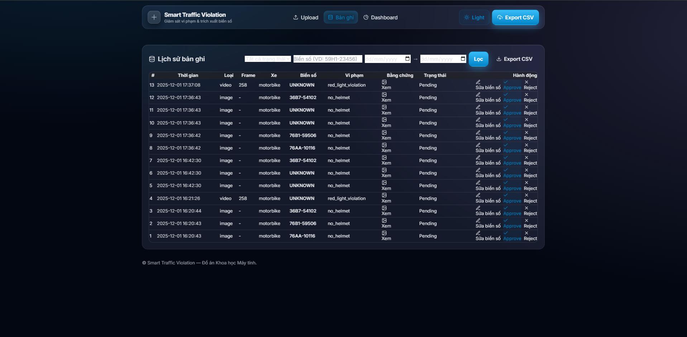
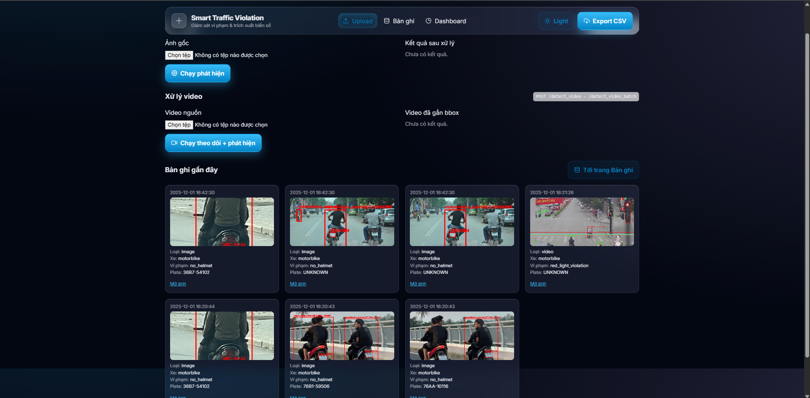
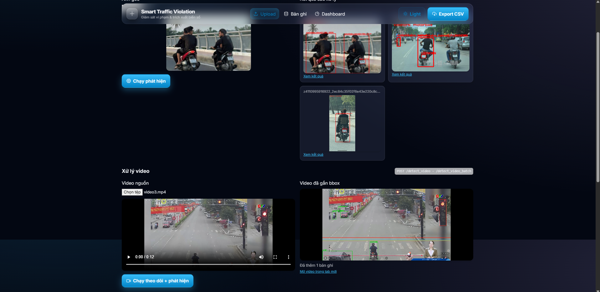

# 📘 Smart Traffic Violation Detection System

*A complete AI-powered traffic violation detection system using YOLOv11, ByteTrack, and PaddleOCR with a Flask-based web dashboard.*

<p align="center">
  
  
  
  
  
  
  
</p>

---

# 📄 1. Project Overview

The **Smart Traffic Violation Detection System** is an AI-powered web application designed to automatically detect, classify, and document traffic violations from images and videos. It integrates state-of-the-art computer vision techniques—including object detection, tracking, and license-plate OCR—to provide a complete intelligent transportation monitoring solution.

This project combines:

* **YOLOv11** for traffic object & violation detection
* **ByteTrack** for multi-object tracking
* **PaddleOCR** for Vietnamese license plate recognition
* **Flask** as backend & UI
* **SQLite** for storing violation data

Users can upload images/videos, review and manage violation evidence, correct license plates, approve or reject records, and visualize statistics via dashboards.

---

# 🚀 2. Key Features

### 🚦 Violation Detection

* Red-light running
* Stop-line crossing
* No helmet
* Triple riding
* Using mobile phone while driving
* Vehicle classification

### 🎥 Video Tracking (ByteTrack)

* High-accuracy multi-object tracking
* Frame-based violation identification
* Snapshot extraction

### 🔠 License Plate Recognition

* PaddleOCR Vietnamese plate reading
* Regex validation
* Normalization and correction

### 🗂 Record Management

* Approve / Reject violations
* Edit license plates
* View evidence (image/video)
* Export CSV

### 📊 Dashboard Analytics

* Violation distribution
* Daily statistics
* Approval tracking
* Top-frequency license plates
* Date filtering

---

# 🧠 3. Technology Stack

| Category  | Technology        |
| --------- | ----------------- |
| Backend   | Python, Flask     |
| Detection | YOLOv11           |
| Tracking  | ByteTrack         |
| OCR       | PaddleOCR         |
| Frontend  | HTML, TailwindCSS |
| Database  | SQLite            |
| Charts    | Chart.js          |

---

# 🖼️ 4. Screenshots (UI Overview)

> Store images in `/assets/` before using these paths.

### Dashboard


### Violation Records



### Upload Interface



### Processed Video Output



---

# 📂 5. Project Structure

```
app/
│── app.py
│── bytetrack.yaml
│── model/
│   ├── DenDoV11_V3.pt
│   ├── nohelmet_V11.pt
│   └── Bienso_V11.pt
│── static/
│   ├── uploads/
│   ├── evidence/
│   ├── video_out/
│   └── favicon.ico
│── templates/
│   ├── base.html
│   ├── dashboard.html
│   ├── records.html
│   └── index.html
│── outputs/
requirements.txt
README.md
.gitignore
```

---

# ⚙️ 6. Installation

### Step 1 — Clone the repository

```bash
git clone https://github.com/<username>/smart-traffic-violation.git
cd smart-traffic-violation
```

### Step 2 — Create virtual environment

```bash
python -m venv venv
venv\Scripts\activate
```

### Step 3 — Install dependencies

```bash
pip install -r requirements.txt
```

---

# 📥 7. Download Model Weights

Model weights are **not included in the repository** due to size limits.
Download the required AI models from the links below:

### **🔗 YOLOv11 Model Downloads (HuggingFace)**

| Task                    | Model             | Download Link                                                                                                                                                      |
| ----------------------- | ----------------- | ------------------------------------------------------------------------------------------------------------------------------------------------------------------ |
| No Helmet Detection     | `nohelmet_V11.pt` | [https://huggingface.co/LePhuocThai003/nohelmet_V11/resolve/main/nohelmet_V11.pt](https://huggingface.co/LePhuocThai003/nohelmet_V11/resolve/main/nohelmet_V11.pt) |
| Red-Light & Stop-Line   | `DenDoV11_V3.pt`  | [https://huggingface.co/LePhuocThai003/DenDo_V11/resolve/main/DenDoV11_V3.pt](https://huggingface.co/LePhuocThai003/DenDo_V11/resolve/main/DenDoV11_V3.pt)         |
| License Plate Detection | `Bienso_V11.pt`   | [https://huggingface.co/LePhuocThai003/BienSo_V11/resolve/main/Bienso_V11.pt](https://huggingface.co/LePhuocThai003/BienSo_V11/resolve/main/Bienso_V11.pt)         |

Place all downloaded files into:

```
app/model/
```

---

# ▶️ 8. Run the Application

```bash
cd app
python app.py
```

Application runs at:

```
http://127.0.0.1:5000/
```

---

# 🔌 9. API Endpoints

| Endpoint        | Method | Description                |
| --------------- | ------ | -------------------------- |
| `/detect_image` | POST   | Detect violations in image |
| `/detect_video` | POST   | Detect & track in video    |
| `/records`      | GET    | Fetch records              |
| `/update_plate` | POST   | Update a plate number      |
| `/approve`      | POST   | Approve violation          |
| `/reject`       | POST   | Reject violation           |

---

# 🗄️ 10. Database Schema

```
violations (
    id INTEGER PRIMARY KEY AUTOINCREMENT,
    time TEXT,
    type TEXT,
    vehicle TEXT,
    plate TEXT,
    frame INTEGER,
    evidence_path TEXT,
    status TEXT
)
```

---

# 📜 11. License

Distributed under the **MIT License**.

